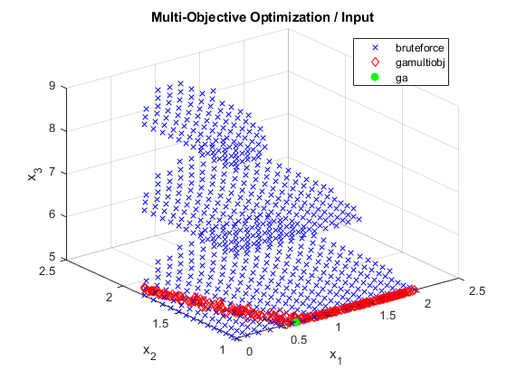
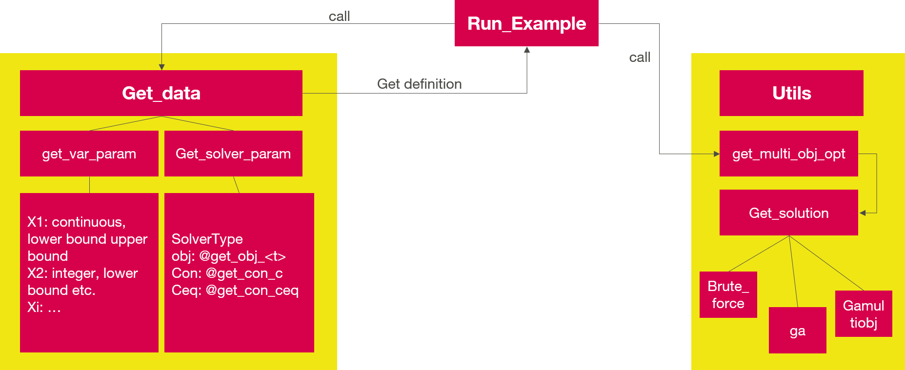

# MATLAB Tool for Multi-Objective Optimization

This **MATLAB** tool offers different functionalities for multi-objective optimization:
* Offer a **common interface** for different solvers
    * **Brute force** grid search (exhaustive search)
    * MATLAB **single-objective genetic** algorithm ('ga')
    * MATLAB **multi-objective genetic** algorithm ('gamultiobj')
* Offer an **abstraction layer** to the MATLAB solver
    * Scaling the input variables
    * Generating and filtering initial points
    * Transforming high-level data structures ('struct') to low-level ('matrix')
    * Generating the low-level inputs required by the solvers
* Allow **vectorized and parallel** evaluation of the functions
    * Divide the number of points to be evaluated into chunks
    * Evaluate the chunks with parallel computing ('parfor')
    * The points inside a chunk are evaluated in a vectorized way

Mathematically, the following optimization problems are solved:
* Multiple variables
* Integer variables
* Upper and lower bounds
* Inequality constraints
* Equality constraints
* Non continuous objective function
* Single-objective or multi-objective goals

## Example

Look at the example [run_example.m](run_example.m) which generates the following results:

    
    

## Adding Solvers

The code is made to take advantage of optimization methods using vectorized evaluation of the objective function.
Therefore, it would be easy to add support for 'patternsearch', 'particleswarm', or 'paretosearch'.
Adding support for non vectorized solvers ('fmincon', 'fminbnd', or 'fminsearch') is possible but less interesting.

## Compatibility

* Tested with MATLAB R2018b.
* The `gads_toolbox` is required (for the MATLAB solvers).
* The `optimization_toolbox` is required (for the MATLAB solvers).
* The `distrib_computing_toolbox` is required (for parfor loops)
* Compatibility with GNU Octave not tested but probably problematic.

## Author

* **Thomas Guillod, ETH Zurich, Power Electronic Systems Laboratory** - [GitHub Profile](https://github.com/otvam)

## Function calling structure

    

## License

* This project is licensed under the **BSD License**, see [LICENSE.md](LICENSE.md).
* This project is copyrighted by: (c) 2019-2020, ETH Zurich, Power Electronic Systems Laboratory, T. Guillod.
